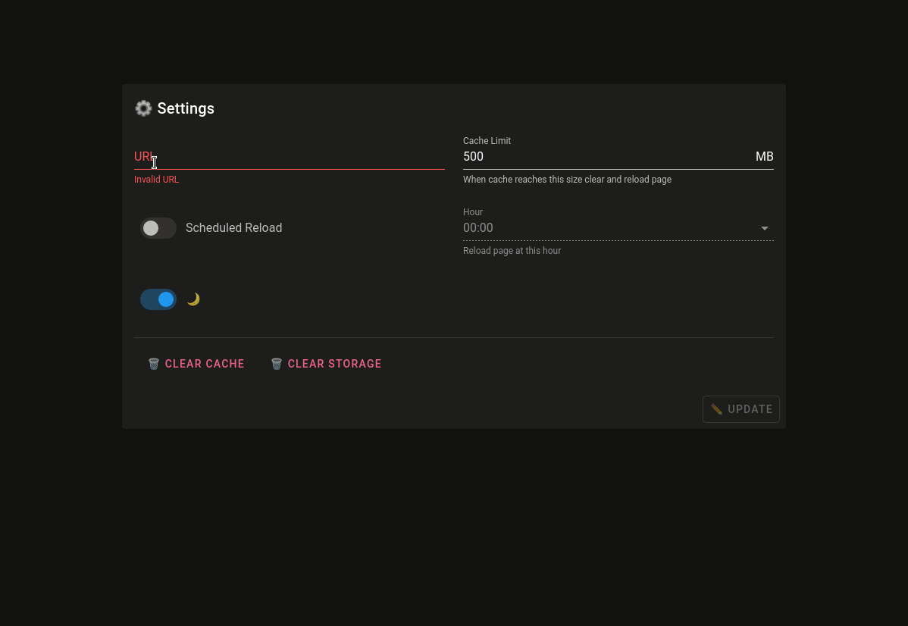

# Electron KIOSK

Simple Electron app to open a website in fullscreen KIOSK mode.

## Usage

You can download latest release from releases section and choose the right package for your platform.

Run the application, settings windows will open by default with the url to load. Once clicked on `UPDATE` button the url will be loaded in fullscreen mode.

To exit kiosk mode press `Ctrl+Shift+K`

## Demo



## Development

Developers tips:

```bash
# serve electron app with hot reloading features
npm run electron:serve

# build electron app for production
npm run electron:build

# generate icons for all platforms
npm run icons
```

